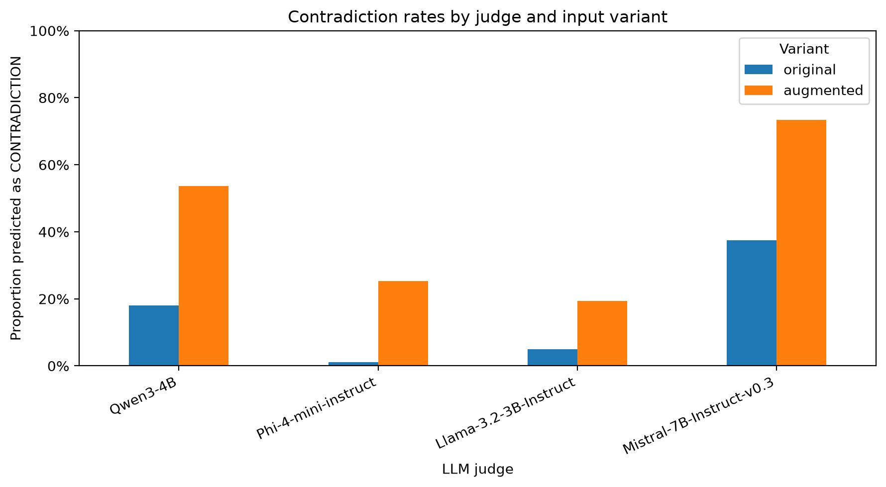
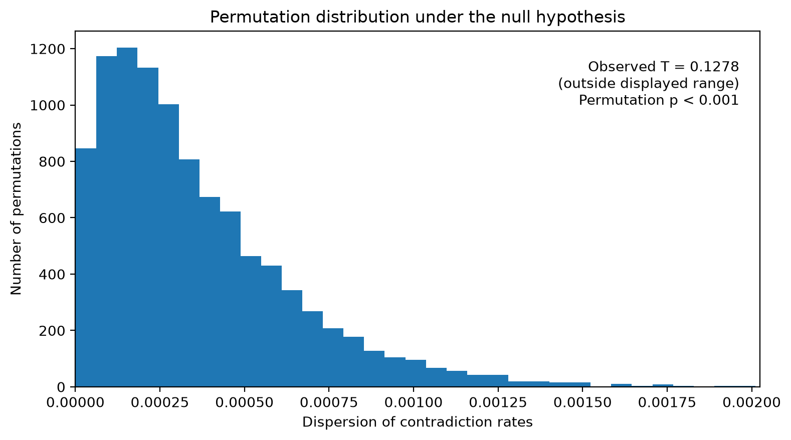
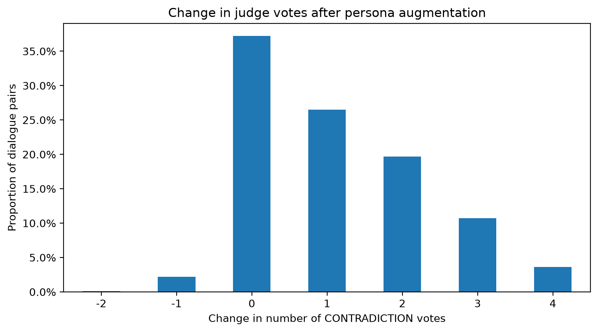
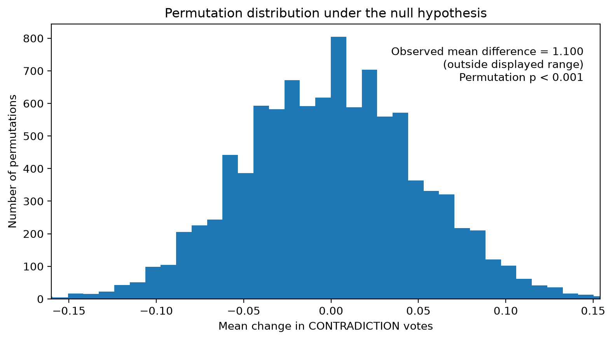
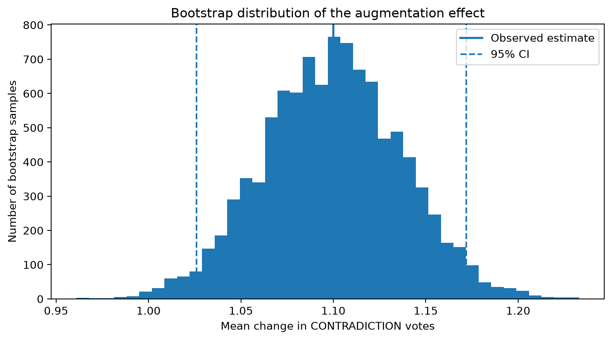
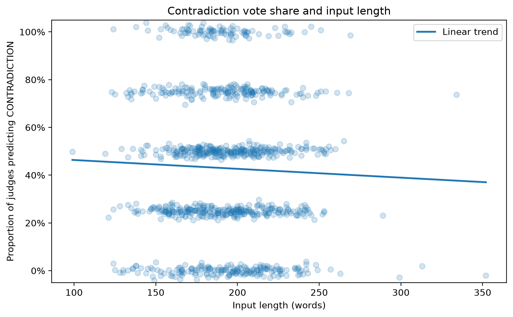
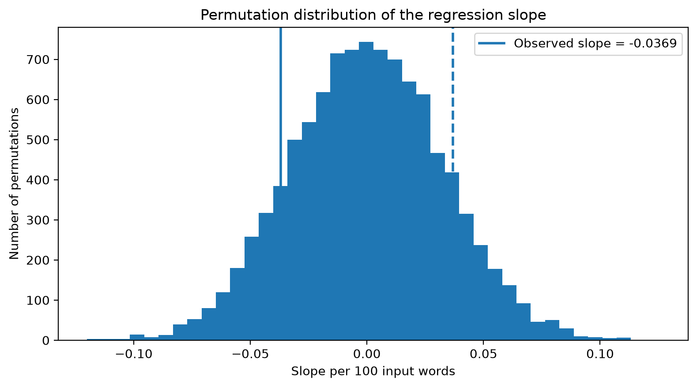
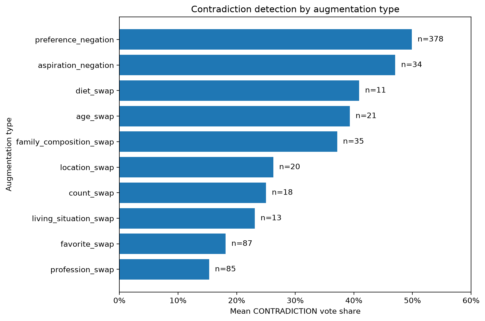
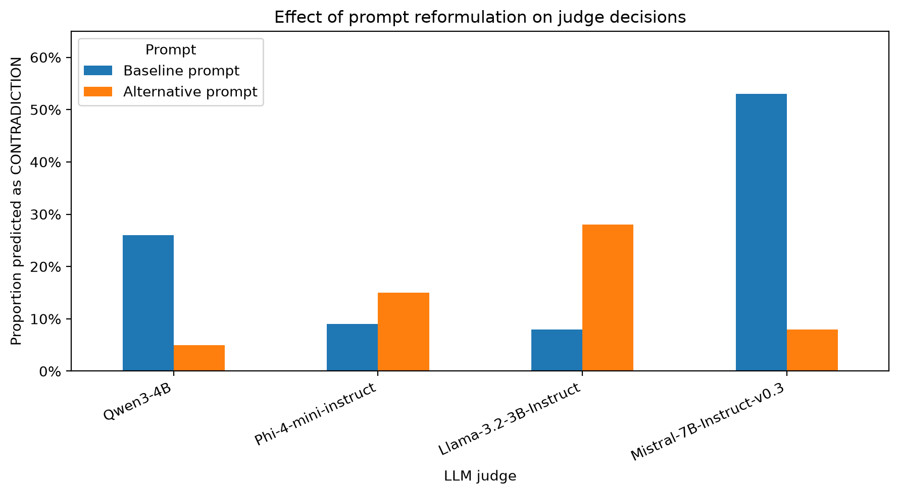

# Agreement of LLM Judges in Persona Contradiction Detection

**Matyáš Martinek**  
**Probability and Statistics I**

## Abstract

Large language models are increasingly used as automatic evaluators, but their
judgments need not be interchangeable. This project studies agreement between
four LLM judges on the task of detecting contradictions between a speaker's
persona and dialogue.

The experiment uses 1,000 PersonaChat dialogues. For each dialogue, an original persona and a contradiction-oriented persona
created by rule-based augmentation are evaluated by four open language models,
producing 2,000 examples and 8,000 binary judgments in total.

The judges have clearly different contradiction rates and only limited
chance-corrected agreement. A permutation test strongly rejects the
null model in which judge identities are interchangeable ($p<0.001$).
Contradiction-oriented augmentation increases the mean number of judges
predicting a contradiction by 1.10 out of four
(95% bootstrap CI [1.03, 1.17], paired permutation $p<0.001$).

No statistically detectable linear relationship is found between input length
and contradiction vote share ($p=0.257$). Exploratory results suggest that
some augmentation categories are considerably easier for the judges to detect
than others. A separate prompt-robustness experiment further shows that the
stability of judgments under a small prompt reformulation differs strongly
between models.

Overall, the results show that both model choice and prompt formulation can
substantially influence LLM-based contradiction judgments.

## 1. Introduction

Large language models are increasingly used not only for text generation but
also as automatic evaluators, often referred to as *LLM judges*. Such judges can
replace or supplement manual annotation when evaluating properties that are
difficult or expensive to assess at scale.

My bachelor's thesis concerns persona consistency in dialogue. A dialogue model
is persona-consistent when statements it makes remain compatible with a
predefined persona. One possible automatic evaluation method is to provide a
persona and dialogue to another language model and ask whether they contain a
contradiction.

Before relying on such judgments, however, it is important to ask whether
different LLM judges behave similarly. If two models apply substantially
different decision thresholds, the measured consistency of the same dialogue
could depend on which judge happens to be selected.

The main research question of this project is therefore:

> **Do different LLM judges agree when detecting persona contradictions?**

Three related questions are also considered:

1. Do the judges differ systematically in how often they predict a
   contradiction?
2. Is contradiction detection related to properties of the evaluated input,
   particularly input length and the type of contradiction-oriented
   augmentation?
3. Does an individual judge remain stable when the same examples are evaluated
   using a slightly reformulated prompt?

The paired structure of the dataset also allows a separate question to be
studied: whether contradiction-oriented persona augmentation systematically
increases the number of judges predicting a contradiction.

The significance level used for confirmatory hypothesis tests is
$\alpha=0.05$.

## 2. Data and experimental design

### 2.1 PersonaChat data

The base data come from the PersonaChat dataset introduced by Zhang et al.
(2018). PersonaChat contains English multi-turn dialogues in which each
participant is assigned a persona represented by several natural-language
statements.

For this project, PersonaChat data were processed as part of a bachelor-thesis
pipeline on persona consistency. Persona facts were automatically grounded in
their corresponding dialogue, identifying facts for which relevant evidence is
present in the conversation.

Contradiction-oriented persona variants were then generated using deterministic
rule-based transformations. Examples include preference negation, age
replacement, profession replacement, favorite replacement, and changes to
family composition or living situation. The dialogue itself remains unchanged.

The automatically generated expected relations are used to construct the
experiment, but they are **not treated as human-verified ground truth**. The
main aim of this project is to study agreement and behaviour of the LLM judges,
rather than to estimate classification accuracy against gold-standard labels.

### 2.2 Experimental sample

The analysis is restricted to rule-based augmented profiles that are intended
to introduce a contradiction and contain at least one augmented persona fact
grounded in the dialogue.

Eligible profiles are randomly shuffled using a fixed seed. To avoid evaluating
multiple speaker profiles from the same conversation, at most one profile is
retained for each dialogue. The first 1,000 unique dialogues from this
deterministic procedure form the experimental sample.

Each selected dialogue produces a matched pair:

- an **original** example containing the original persona,
- an **augmented** example containing the rule-modified persona.

The dialogue is identical within each pair. The final experiment therefore
contains:

- 1,000 unique dialogues,
- 1,000 original examples,
- 1,000 augmented examples,
- 2,000 examples in total.

This paired design is important because comparisons between original and
augmented personas can be made within the same dialogue rather than across
unrelated examples.

### 2.3 LLM judges

Four open instruction-tuned language models are used as judges:

- Qwen3-4B,
- Phi-4-mini-instruct,
- Llama-3.2-3B-Instruct,
- Mistral-7B-Instruct-v0.3.

Each judge receives the complete persona and dialogue and must output exactly
one binary label:

- `CONTRADICTION`,
- `NO_CONTRADICTION`.

The prompt specifies that only statements made by the target speaker count as
evidence about that speaker, missing discussion of a persona fact is not a
contradiction, and temporal or modal differences should only count when they
are genuinely incompatible.

Inference is deterministic. The same frozen experimental sample and prompt are
used for all four judges, and the exact model revision used for each evaluation
is recorded with the resulting judgments.

## 3. Statistical methods

### 3.1 Contradiction rates and inter-judge agreement

The first descriptive quantity is each judge's **contradiction rate**, defined
as the proportion of examples labeled `CONTRADICTION`.

This is distinct from agreement. Two judges may agree frequently simply because
both strongly prefer the same majority label.

Pairwise agreement is therefore summarized using two statistics:

- **raw agreement**, the proportion of examples for which two judges produce
  the same label;
- **Cohen's kappa**, which adjusts observed agreement for the agreement expected
  from the judges' marginal label frequencies.

Fleiss' kappa is additionally used as a compact summary of agreement among all
four judges simultaneously.

Agreement is reported both for the complete experiment and separately for
original and augmented examples.

### 3.2 Permutation test for differences between judges

The main confirmatory test investigates whether judge identity is systematically
associated with contradiction tendency.

The null hypothesis is

$$
H_0:
\text{the four judges have the same contradiction tendency},
$$

against

$$
H_1:
\text{at least one judge has a different contradiction tendency}.
$$

The test statistic is the dispersion of the four judge-specific contradiction
rates,

$$
T = \sum_{j=1}^{4} (p_j-\bar p)^2,
$$

where $p_j$ is the contradiction rate of judge $j$.

Under the null hypothesis, judge identities are treated as exchangeable. Within
each dialogue pair, the four judge labels are randomly permuted. The same
permutation is applied to both the original and augmented example of the pair,
preserving the paired experimental structure.

A Monte Carlo null distribution is constructed from 10,000 permutations. The
p-value is calculated using the standard +1 correction.

### 3.3 Effect of contradiction-oriented augmentation

For dialogue pair $i$, let

$$
O_i
$$

denote the number of judges predicting `CONTRADICTION` for the original persona
and

$$
A_i
$$

the corresponding number for the augmented persona. Both variables range from
0 to 4.

The paired difference is

$$
D_i = A_i-O_i.
$$

The mean of $D_i$ measures how many additional judges, on average, predict a
contradiction after augmentation.

Because original and augmented examples belong to the same dialogue, a paired
permutation test is used. Under the null hypothesis, the labels *original* and
*augmented* are exchangeable within each pair. Randomly swapping the conditions
is equivalent to independently replacing each difference $D_i$ by either
$D_i$ or $-D_i$.

The one-sided alternative is that contradiction-oriented augmentation increases
the number of contradiction votes.

A 95% percentile bootstrap confidence interval for the mean paired difference
is also calculated by resampling the 1,000 dialogue pairs with replacement.

### 3.4 Input length

To investigate whether judge behaviour is related to input length, the analysis
uses only the 1,000 augmented examples. This gives one observation per sampled
dialogue and avoids mixing the relationship with the strong original-versus-
augmented difference.

For each example, the response variable is the fraction of the four judges
predicting `CONTRADICTION`.

A simple linear regression is used to summarize the relationship between input
length and contradiction vote share. The slope is expressed per 100 input
words.

A two-sided permutation test is then used with the regression slope as the test
statistic. Under the null model, contradiction vote shares are exchangeable
with respect to input length. Vote shares are therefore randomly permuted among
the 1,000 examples and the slope is recalculated for each of 10,000
permutations.

### 3.5 Augmentation type

As an exploratory analysis, contradiction vote share is compared across
rule-based augmentation categories.

Because a persona can contain several different augmentation types, the primary
comparison is restricted to profiles containing exactly one **unique**
augmentation type. This leaves 702 of the 1,000 augmented profiles.

Category sizes are highly unequal and some categories contain only a small
number of examples. The comparison is therefore descriptive and no
confirmatory hypothesis test is performed between augmentation categories.

### 3.6 Prompt robustness

Finally, prompt robustness is studied on a frozen subset of 50 dialogue pairs,
corresponding to 100 examples.

Each judge evaluates the same examples using:

- the baseline prompt,
- one alternative prompt that preserves the same contradiction definition and
  binary output format but reformulates and reorders the instructions.

Model revision, input data and deterministic decoding settings are held fixed.

For each model, robustness is summarized by raw agreement, Cohen's kappa,
changes in contradiction rate, and the direction of changed decisions.

A 95% confidence interval for raw agreement is obtained using a pair-level
bootstrap. The 50 dialogue pairs are sampled with replacement so that the
original and augmented examples belonging to the same dialogue remain together.

## 4. Results

### 4.1 Contradiction tendencies and agreement

The four judges differ substantially in how often they predict
`CONTRADICTION`.

| Judge | Overall | Original | Augmented |
|---|---:|---:|---:|
| Qwen3-4B | 35.9% | 18.1% | 53.6% |
| Phi-4-mini-instruct | 13.2% | 1.1% | 25.3% |
| Llama-3.2-3B-Instruct | 12.2% | 5.0% | 19.4% |
| Mistral-7B-Instruct-v0.3 | 55.5% | 37.5% | 73.4% |

{ width=82% }

Mistral is therefore the most contradiction-prone judge, followed by Qwen,
whereas Phi and Llama are substantially more conservative. All four judges
predict contradictions more frequently for augmented than for original
personas.

Pairwise raw agreement across all examples ranges from 54.6% for
Llama--Mistral to 85.4% for Phi--Llama. Cohen's kappa ranges only from 0.162 to
0.379, indicating considerably less agreement after accounting for the judges'
marginal prediction frequencies.

The difference between raw agreement and kappa is especially visible for
original examples. Phi and Llama agree on 95.1% of original examples, but their
Cohen's kappa is only 0.182 because both judges overwhelmingly predict
`NO_CONTRADICTION`.

Fleiss' kappa is 0.100 for original examples and 0.170 for augmented examples,
again indicating relatively low agreement among all four judges beyond that
expected from their marginal label frequencies.

### 4.2 Are judge differences systematic?

The largest observed difference between judge contradiction rates is 43.25
percentage points.

The observed rate-dispersion statistic is

$$
T_{\mathrm{obs}} = 0.1278.
$$

None of the 10,000 random judge-identity permutations produces a statistic as
large as the observed one. With the +1 correction, the Monte Carlo p-value is

$$
p = \frac{1}{10001} \approx 0.0001 < 0.001.
$$

The null hypothesis of equal contradiction tendency is therefore rejected.
There is strong evidence that the four judges apply systematically different
contradiction tendencies.

### 4.3 Effect of persona augmentation

Contradiction-oriented augmentation produces a strong directional change in
judge decisions.

The mean number of contradiction votes increases from

$$
0.617
$$

out of four judges for original personas to

$$
1.717
$$

for augmented personas. The mean paired difference is therefore

$$
\bar D = 1.100.
$$

Across the 1,000 dialogue pairs:

- 60.5% receive more contradiction votes after augmentation,
- 37.2% receive the same number,
- 2.3% receive fewer contradiction votes.

The paired permutation test produces $p<0.001$, providing strong evidence
against the null model in which original and augmented labels are exchangeable
within dialogue pairs.

The 95% percentile bootstrap confidence interval for the mean increase is

$$
[1.026,\ 1.172].
$$

Thus, for this fixed set of four judges, contradiction-oriented augmentation
increases the number of judges predicting a contradiction by approximately
**1.10 judges out of four on average**.

### 4.4 Input length

The estimated regression slope is

$$
-0.0369
$$

in contradiction vote share per additional 100 input words, corresponding to a
decrease of approximately 3.7 percentage points.

However, the observed Pearson correlation is only

$$
r=-0.036.
$$

The two-sided permutation test gives

$$
p=0.257.
$$

The null model is therefore not rejected at the 5% significance level. The
analysis does not provide evidence for a systematic **linear** relationship
between input length and contradiction vote share.

This should not be interpreted as evidence that input length has no possible
relationship with judge behaviour; the test specifically targets a linear
trend.

### 4.5 Augmentation type

Contradiction detection varies considerably across augmentation categories.

Among profiles containing only one unique augmentation type,
`preference_negation` has a mean contradiction vote share of 49.9%
($n=378$) and `aspiration_negation` 47.1% ($n=34$).

By contrast, `favorite_swap` has a mean vote share of 18.1%
($n=87$) and `profession_swap` only 15.3% ($n=85$).

{ width=80% }

This pattern suggests that explicit polarity-changing augmentations such as
preference or aspiration negation are more readily identified by the judges
than some replacement-based augmentations.

The result is exploratory. Category sizes are unequal, several categories are
small, and some single-type profiles contain multiple applications of the same
rule. Differences may therefore reflect both augmentation category and the
number of modified persona facts.

### 4.6 Prompt robustness

Prompt robustness differs substantially between judges.

| Judge | Baseline contradiction rate | Alternative prompt | Raw agreement | Cohen's $\kappa$ |
|---|---:|---:|---:|---:|
| Qwen3-4B | 26% | 5% | 79% | 0.261 |
| Phi-4-mini-instruct | 9% | 15% | 94% | 0.718 |
| Llama-3.2-3B-Instruct | 8% | 28% | 76% | 0.239 |
| Mistral-7B-Instruct-v0.3 | 53% | 8% | 53% | 0.105 |

Phi is the most stable judge under the tested reformulation. Its raw agreement
is 94%, with a pair-bootstrap 95% confidence interval of [89%, 98%].

Qwen has 79% raw agreement (95% CI [70%, 87%]), while its contradiction rate
decreases from 26% to 5%. All 21 changed decisions move from
`CONTRADICTION` to `NO_CONTRADICTION`.

Llama has 76% raw agreement (95% CI [66%, 86%]). Its contradiction rate moves
in the opposite direction, increasing from 8% to 28%. Of its 24 changed
decisions, 22 move from `NO_CONTRADICTION` to `CONTRADICTION`.

Mistral is the least stable under the tested reformulation. Its raw agreement
is only 53% (95% CI [42%, 63%]), and its contradiction rate decreases from 53%
to 8%. Of the 47 changed decisions, 46 move from `CONTRADICTION` to
`NO_CONTRADICTION`.

The changed decisions are strongly directional, and the direction differs
between models. The effect of the prompt reformulation therefore differs
substantially across models.

## 5. Discussion

The main result is that different LLM judges should not be treated as
interchangeable for persona contradiction detection.

The four models differ not only in individual predictions but also in their
overall willingness to label an example as contradictory. This matters when
interpreting raw agreement: two conservative judges can agree frequently
because both overwhelmingly choose `NO_CONTRADICTION`, even though their
chance-corrected agreement is much weaker.

The permutation analysis confirms that these differences are systematic within
the experimental sample. The result is practically important because the
measured consistency of exactly the same dialogue can depend substantially on
which model is selected as judge.

The augmentation experiment gives a second clear result. Keeping the dialogue
fixed while replacing the original persona with a contradiction-oriented
variant increases contradiction votes by 1.10 judges out of four on average.
The paired design controls for differences between dialogues and provides both
a highly significant permutation result and a relatively narrow bootstrap
confidence interval.

At the same time, the judges do not react equally to every kind of
augmentation. The exploratory category analysis suggests that direct polarity
changes are easier to identify than some value-replacement rules. This may be
relevant when designing or evaluating persona-consistency benchmarks: the
apparent difficulty of a benchmark can depend on how contradictions are
constructed.

The input-length analysis gives a useful negative result. Despite the
possibility that longer contexts might make contradiction detection harder,
the data provide no evidence for a systematic linear trend in contradiction
vote share over the observed range of input lengths.

Prompt robustness further demonstrates that judge behaviour depends on more
than model identity. A semantically similar reformulation has little effect on
Phi but changes almost half of Mistral's judgments. Moreover, the changes are
not in the same direction across models. This suggests that results based on a single fixed judging prompt may hide
substantial sensitivity to prompt wording.

### Limitations

Several limitations should be considered.

First, the automatically derived expected relations are not human-verified
ground truth. The original examples are not guaranteed to be entirely
contradiction-free, and an automatically augmented example is not guaranteed
to contain an unambiguous semantic contradiction. For this reason, the project
focuses primarily on agreement and judge behaviour rather than classification
accuracy.

Second, the experiment uses a selected subset of rule-based augmented
PersonaChat profiles with grounded changed facts. The sampling procedure is
designed for the controlled comparisons in this project and is not a
probability sample intended to provide population estimates for all PersonaChat
dialogues.

Third, the four LLM judges are a fixed set of relatively small open models,
rather than a random sample from a population of possible language models.
Consequently, bootstrap confidence intervals quantify sampling variation across
dialogue pairs **for this fixed set of four judges**. They do not quantify
uncertainty over other possible LLM judges.

Fourth, the augmentation-type analysis is exploratory. Only 702 augmented
profiles contain a single unique augmentation type, category sizes are highly
unequal, and some profiles contain multiple applications of the same rule.

Fifth, the input-length test specifically targets a linear trend. Failure to
reject its null model does not imply that input length is unrelated to judge
behaviour in every possible way.

Finally, prompt robustness is evaluated using only one alternative prompt and
50 dialogue pairs. The observed differences demonstrate sensitivity under this
specific reformulation, but they should not be interpreted as general estimates
of each model's robustness to arbitrary prompt changes.

## 6. Conclusion

This project investigated agreement between four LLM judges on persona
contradiction detection.

The judges exhibit clearly different contradiction rates and only
limited chance-corrected agreement. A permutation test provides strong evidence
that the observed differences in contradiction rates are systematic.

Contradiction-oriented persona augmentation produces a clear paired effect. On
average, augmented personas receive 1.10 additional `CONTRADICTION` votes out
of four judges, with a 95% bootstrap confidence interval of [1.03, 1.17] and a
paired permutation result of $p<0.001$.

The secondary analyses provide a more nuanced picture. No statistically
detectable linear relationship is found between input length and contradiction
vote share, while exploratory results indicate substantial differences between
augmentation categories. Prompt stability also varies strongly across models.

Overall, LLM-based contradiction judgments are not fully interchangeable across
models or prompts. When LLM judges are used to evaluate persona consistency,
the choice of judge, the distribution of its predictions, inter-judge
agreement, and sensitivity to prompt formulation should all be considered
alongside the judgments themselves.

## References

Zhang, S., Dinan, E., Urbanek, J., Szlam, A., Kiela, D., & Weston, J. (2018).
*Personalizing Dialogue Agents: I have a dog, do you have pets too?*
Proceedings of the 56th Annual Meeting of the Association for Computational
Linguistics, 2204--2213.
https://doi.org/10.18653/v1/P18-1205